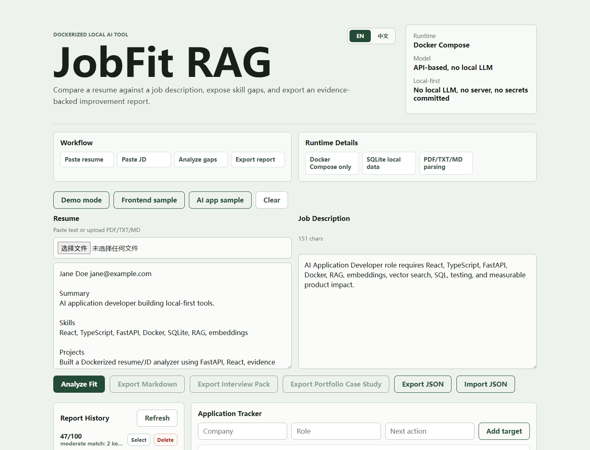
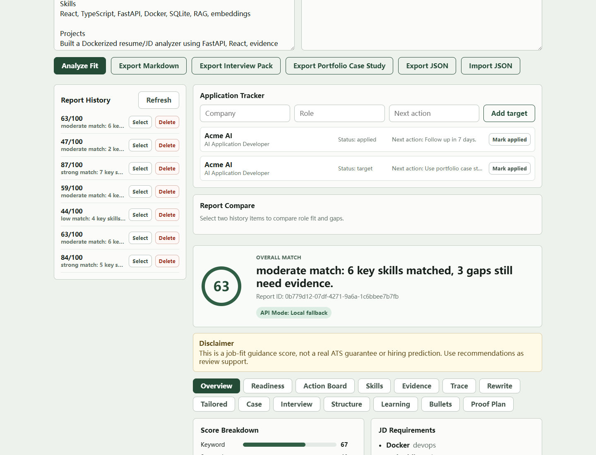
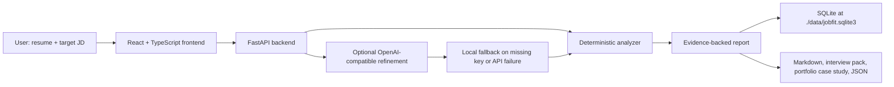
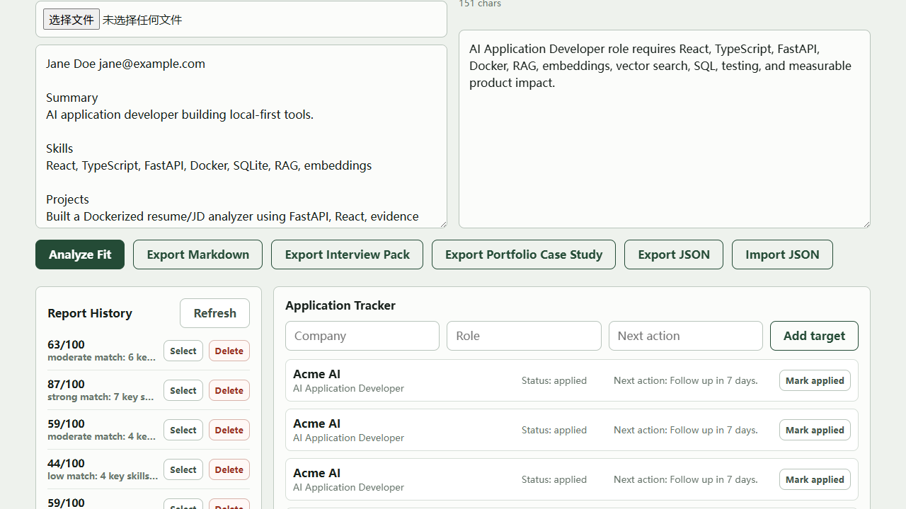
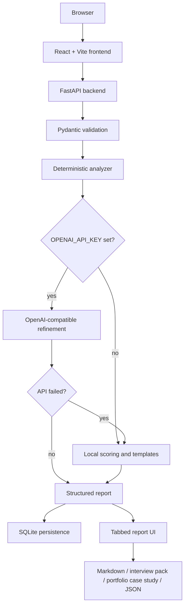

# JobFit RAG

Portfolio-grade, Dockerized AI job-fit analyzer for turning a resume and target job description into evidence, gaps, interview prep, and next actions.

JobFit RAG is a local-first, evidence-grounded resume/JD analyzer with optional AI refinement. It uses a RAG-style grounding pattern against resume and JD evidence; it is not a traditional vector-database RAG platform in v1.

Current version: v2.6.

## What It Shows

JobFit RAG demonstrates practical AI application engineering instead of a thin chat wrapper:

- full-stack product workflow with React, TypeScript, FastAPI, and SQLite
- local-first data handling for private career documents
- deterministic fallback analysis that works without API keys
- optional OpenAI-compatible refinement when an API key is available
- evidence-backed scoring, proof planning, interview prep, and Markdown exports
- Docker-first setup that runs on a weak laptop without local LLMs or heavy services

## Why It Exists

Most resume tools stop at a match score. This project turns the score into a defensible portfolio workflow:

1. Map resume evidence against a real JD.
2. Separate direct evidence from weak keyword mentions.
3. Generate proof tasks for missing or weak skills.
4. Package the result as a report, interview pack, and README-ready case study.
5. Keep everything local, inspectable, and repeatable.

## Quick Demo

```powershell
cd D:\VsCodeProjects\jobfit-rag
.\scripts\reset-demo.ps1  # starts Docker Compose and seeds demo data
```

If Docker is unavailable during local debugging, use the Docker-free gate and runbook instead:

```powershell
.\scripts\verify-local.ps1
.\scripts\reset-demo.ps1 -NoDocker -NoSeed  # only backs up/removes ./data/jobfit.sqlite3
```

Then follow [docs/local-demo-runbook.md](docs/local-demo-runbook.md).

Open:

```text
http://localhost:3000
```

Then show:

- `Analyze Fit`
- `Readiness`
- `Action Board`
- `Proof Plan`
- `Export Portfolio Case Study`
- `Export Interview Pack`

## Demo Evidence

These screenshots are captured from the Docker Compose app running locally.





## Portfolio Proof

The app can export three interview-ready artifacts:

- full job-fit report: score, evidence trace, structure checks, learning plan, proof plan, action board
- interview pack: positioning statement, STAR answers, risk notes, close pitch
- portfolio case study: headline, problem, solution, architecture, trade-offs, proof artifacts, readiness, next actions, resume bullet

## Architecture Proof



The architecture is intentionally small:

- Docker Compose runs the whole app with no host Node or Python install for normal use.
- SQLite keeps private career data local and easy to reset before demos.
- Deterministic analysis makes the app useful without API keys.
- Optional API refinement improves semantic scoring when tokens are available.
- No vector database, PostgreSQL, Redis, local LLM, or worker queue is required for this scope.

## Privacy And Trust

The safe default is local and deterministic:

- resume text, JDs, reports, and application notes are stored in local SQLite at `./data/jobfit.sqlite3`
- `data/` and `.env` are ignored by git
- `.env.example` contains placeholders only
- OpenAI-compatible API calls are optional and only run when `OPENAI_API_KEY` is set
- missing keys or API failures fall back to the deterministic analyzer
- `scripts/smoke.ps1` includes a local secret scan before sharing the project and redacts raw secret matches from failure output
- frontend API errors show status-only messages instead of raw backend response bodies
- local verification scripts redact HTTP response bodies and private assertion values in failure output where they may be derived from resume/JD content

See [docs/privacy.md](docs/privacy.md) for the full privacy and trust note.

## Development Guide

For the day-to-day local workflow, environment notes, verification gates, and safe refactor order, see [docs/development.md](docs/development.md).

Useful operational docs:

- [PRD](docs/PRD.md)
- [Constraints](docs/CONSTRAINTS.md)
- [Verification Guide](docs/VERIFICATION.md)
- [Architecture Decisions](docs/ADR)
- [Local Demo Runbook](docs/local-demo-runbook.md)
- [Browser Smoke Checklist](docs/browser-smoke.md)
- [Demo Readiness Checklist](docs/demo-readiness-checklist.md)
- [Troubleshooting Guide](docs/troubleshooting.md)
- [Maintenance Guide](docs/maintenance.md)
- [Project Handoff](docs/project-handoff.md)

## Verification Commands

```powershell
.\scripts\reset-demo.ps1  # Docker Compose reset + seed
.\scripts\evaluate-fixtures.ps1
.\scripts\check-markdown-quality.ps1
.\scripts\check-api-contract.ps1
.\scripts\check-data-integrity.ps1
.\scripts\check-negative-paths.ps1
.\scripts\check-accessibility.ps1
.\scripts\check-resume-matrix.ps1
.\scripts\smoke.ps1
```

`evaluate-fixtures.ps1` checks stable resume/JD fixtures against expected score ranges, matched skills, missing skills, API mode, readiness, action items, and report sections.

`check-markdown-quality.ps1` verifies the report, interview pack, and portfolio case study Markdown structures contain required sections and core report content.

`check-api-contract.ps1` pulls `/openapi.json` and verifies required paths, schemas, and fields without writing tracked files by default. Use `-UpdateSnapshot` to refresh [docs/openapi.json](docs/openapi.json).

`check-data-integrity.ps1` verifies report export/import roundtrip behavior, duplicate import skipping, and non-overwrite safety for existing reports.

`check-negative-paths.ps1` verifies stable error behavior for invalid analyze payloads, unsupported resume uploads, missing reports, missing applications, and unsupported import versions.

`check-accessibility.ps1` verifies core frontend accessibility hooks: labeled inputs, live regions, tab semantics, pressed states, hidden file input handling, and focus-visible styling.

`check-resume-matrix.ps1` verifies the resume version matrix API compares baseline and tailored resumes against the same JD.

`smoke.ps1` verifies Docker builds, backend tests, frontend build, accessibility, runtime health, frontend HTTP, API analyze output, resume matrix, evaluation fixtures, Markdown quality, API contract, data integrity, negative paths, and a redacted secret scan. Failed child-script output is redacted before smoke reports the failure.

For the full sharing checklist, see [docs/release-checklist.md](docs/release-checklist.md).

## CI Lite

The repository includes `.github/workflows/smoke.yml` for GitHub Actions.

It runs the same Docker-first verification path without secrets:

- Docker versions
- `scripts/reset-demo.ps1 -NoBackup`
- `scripts/smoke.ps1`
- `docker compose ps`
- `docker compose down`

## Interview Pack

For a Chinese interview talk track, architecture explanation, privacy explanation, CI explanation, resume bullets, and common Q&A, see [docs/interview-zh.md](docs/interview-zh.md).

## Evaluation Fixtures

The project includes deterministic analyzer fixtures in [docs/evaluation-fixtures.json](docs/evaluation-fixtures.json).

Run:

```powershell
.\scripts\evaluate-fixtures.ps1
```

The fixture check is also part of `scripts/smoke.ps1`.

## Markdown Quality Gate

The project includes [scripts/check-markdown-quality.ps1](scripts/check-markdown-quality.ps1).

It calls `/api/analyze`, builds the same three export surfaces conceptually used by the frontend, and checks required sections for:

- full report Markdown
- interview pack Markdown
- portfolio case study Markdown

The Markdown quality gate is also part of `scripts/smoke.ps1`.

## API Contract

The project includes [docs/api-contract.md](docs/api-contract.md), [docs/openapi.json](docs/openapi.json), and [scripts/check-api-contract.ps1](scripts/check-api-contract.ps1).

Run:

```powershell
.\scripts\check-api-contract.ps1
```

The contract check is also part of `scripts/smoke.ps1`.

## Data Integrity Gate

The project includes [scripts/check-data-integrity.ps1](scripts/check-data-integrity.ps1).

Run:

```powershell
.\scripts\check-data-integrity.ps1
```

The gate calls the running backend, exports a report, deletes it, restores it, then verifies duplicate imports are skipped and do not overwrite existing report data.

The data integrity gate is also part of `scripts/smoke.ps1`.

## Negative Path Gate

The project includes [scripts/check-negative-paths.ps1](scripts/check-negative-paths.ps1).

Run:

```powershell
.\scripts\check-negative-paths.ps1
```

The gate calls the running backend and verifies stable validation, 400, and 404 responses without deleting existing report data.

The negative path gate is also part of `scripts/smoke.ps1`.

## Accessibility Gate

The project includes [scripts/check-accessibility.ps1](scripts/check-accessibility.ps1).

Run:

```powershell
.\scripts\check-accessibility.ps1
```

The gate statically checks the React UI for key accessibility wiring: textarea IDs and descriptions, upload labels, pressed states, live regions, tab roles, tab panels, tracker input labels, and visible focus styles.

The accessibility gate is also part of `scripts/smoke.ps1`.

## Resume Version Matrix

The project includes `POST /api/resume-matrix`, a frontend matrix panel, and [scripts/check-resume-matrix.ps1](scripts/check-resume-matrix.ps1).

Run:

```powershell
.\scripts\check-resume-matrix.ps1
```

The matrix compares two to four resume versions against the same JD and returns the best version, score delta, gained skills, remaining gaps, readiness score, and recommendations.

The resume matrix gate is also part of `scripts/smoke.ps1`.

## Hardware Fit

Designed for constrained local machines:

- no local LLM
- no GPU
- no PostgreSQL
- no Redis
- no Kubernetes
- no vector database
- no host Node/Python install required for normal use

## Features



- Paste resume text and job description
- Upload PDF, TXT, or Markdown resumes
- Switch UI and Markdown export between English and Simplified Chinese
- Use labeled inputs, visible keyboard focus, live status regions, and accessible report tabs
- Persist language preference in the browser
- Toggle a read-only portfolio demo mode for interviews
- Compare baseline and tailored resume versions against the same JD
- Extract job requirements from the JD
- Compare resume evidence against target skills
- Show skill-level evidence trace with resume evidence, JD evidence, gap reason, and recommendation
- Score evidence quality as direct, weak, or missing so keyword-only claims are easy to spot
- Split scoring into keyword, semantic, and structure components
- Add ATS-style structure checks for contact info, summary, skills, experience evidence, and measurable impact
- Generate a 7-day learning plan from missing skills
- Generate a proof artifact plan for weak or missing evidence
- Score portfolio readiness with strengths, blockers, and next best action
- Turn proof gaps, readiness blockers, and weak resume bullets into a prioritized action board
- Score resume bullets with action / technology / result / metric rubric
- Generate a truthful tailored resume draft for the target JD
- Generate a portfolio case study for interview walkthroughs
- Export a README-ready portfolio case study Markdown file
- Generate an interview pack with positioning statement, STAR answers, risk notes, and close pitch
- Show API mode: local fallback, API refinement, or API failed fallback
- Generate:
  - overall match score
  - matched skills
  - missing skills
  - resume/JD evidence
  - resume improvement suggestions
  - optimized resume bullet points
  - interview questions
- Persist reports in SQLite
- Track target applications with company, role, status, next action, and linked report context
- Browse, open, and delete saved report history
- Select two history reports and compare score delta, gained skills, and remaining gaps
- Export and import report history as JSON
- Export report as Markdown
- Export a focused interview pack as Markdown
- Export a portfolio case study as Markdown
- Export component scores, structure analysis, portfolio readiness, action board, evidence trace, tailored draft, case study, learning plan, proof plan, bullet rubric, comparison summary, and disclaimer in Markdown
- Run a Docker-first local smoke script for build, test, runtime, API, and secret-scan checks
- Reset local demo data to a clean seeded SQLite state for repeatable interviews
- Load sample data for frontend and AI application roles
- Show workflow and runtime detail panels
- Run with Docker Compose

## Architecture



The app works without API keys by using deterministic local analysis. When `OPENAI_API_KEY` is set, the backend uses OpenAI-compatible embedding and chat endpoints for semantic scoring and report refinement, then falls back locally if the API is unavailable.

## Requirements

- Docker Desktop
- Docker Compose
- Optional: OpenAI-compatible API key

No Node or Python dependencies need to be installed on the host machine.

## Quick Start

```powershell
cd D:\VsCodeProjects\jobfit-rag
docker compose up --build
```

Open:

```text
http://localhost:3000
```

Backend health:

```text
http://localhost:8000/health
```

## Environment

Optional: create `.env` from `.env.example` when you want API-based LLM and embedding refinement.

```env
OPENAI_API_KEY=
OPENAI_BASE_URL=https://api.openai.com/v1
OPENAI_CHAT_MODEL=gpt-4.1-mini
OPENAI_EMBEDDING_MODEL=text-embedding-3-small
BACKEND_PORT=8000
FRONTEND_PORT=3000
```

Do not commit `.env`.

If `OPENAI_API_KEY` is empty, JobFit RAG still runs with deterministic local analysis.

## Sample Demo

Paste this resume, or save it as a `.txt` file and upload it:

```text
Frontend developer with experience building React and TypeScript dashboards.
Built Dockerized FastAPI services for AI workflows and local-first tools.
Created REST API integrations, SQLite persistence, and tested user flows.
```

Paste this JD:

```text
We are hiring an AI application developer.
Requirements: React, TypeScript, FastAPI, Docker, RAG, embeddings, vector search, SQL, testing, and clear product thinking.
The candidate should build local-first tools and explain trade-offs.
```

Expected result:

- Match score above zero
- Component scores appear
- Matched skills include React, TypeScript, FastAPI, Docker
- Missing skills include RAG, Embedding, Vector Search or SQL depending on resume wording
- Structure analysis appears
- API mode appears
- Report history stores the result
- Learning plan and bullet rubric appear
- Evidence trace, tailored resume draft, and case study appear
- Evidence trace shows quality and quality score per skill
- Interview pack appears and can be exported as Markdown
- Proof plan appears for missing or weak evidence
- Portfolio readiness appears with score, level, strengths, blockers, and next action
- Action board appears with prioritized next tasks from proof gaps, readiness blockers, and low-scoring bullets
- Portfolio case study export downloads a README-ready Markdown story
- Application tracker can add a target role and mark it as applied
- Two history reports can be selected for comparison
- Suggestions and interview questions appear
- Markdown export downloads a report

## API

### Health

```http
GET /health
```

### Analyze

```http
POST /api/analyze
Content-Type: application/json
```

```json
{
  "resume_text": "React TypeScript Docker FastAPI...",
  "jd_text": "Role requires React, TypeScript, RAG, Embedding..."
}
```

### Resume Matrix

```http
POST /api/resume-matrix
Content-Type: application/json
```

Compares two to four resume versions against one JD and returns best version, score delta, gained skills, remaining gaps, and recommendations.

### Reports

```http
GET /api/reports
GET /api/reports/{id}
DELETE /api/reports/{id}
GET /api/reports-export
POST /api/reports-import
```

Compatible imports restore missing reports and skip reports whose IDs already exist, so repeated imports do not overwrite local report data.

### Applications

```http
GET /api/applications
POST /api/applications
PATCH /api/applications/{id}
```

### Parse Resume

```http
POST /api/parse-resume
Content-Type: multipart/form-data
```

Supports PDF, TXT, Markdown, and plain text files.

## Research Inspiration

See [docs/research.md](docs/research.md) for reviewed projects and product patterns.

## Release Checklist

Before sharing the project, run the local reset and smoke checks, inspect screenshots, and confirm private files are not included. See [docs/release-checklist.md](docs/release-checklist.md).

## Chinese Interview Pack

See [docs/interview-zh.md](docs/interview-zh.md) for a Chinese 30-second intro, 2-minute script, architecture explanation, privacy explanation, CI explanation, resume bullets, and common interview Q&A.

## Portfolio Resume Bullets

- Built a Dockerized full-stack AI job-fit analyzer with React, TypeScript, FastAPI, SQLite persistence, and evidence-backed report generation.
- Designed a local-first evidence-grounded resume/JD workflow with keyword, semantic, and structure scoring without requiring local LLMs, GPU, or paid infrastructure.
- Implemented PDF resume parsing, report history, bilingual UI/export, ATS-style structure checks, Markdown export, and Docker Compose onboarding.
- Added portfolio demo mode, report comparison, learning plans, and bullet-level resume scoring for interview-ready product storytelling.
- Added skill-level evidence trace, tailored resume draft, case study mode, and JSON import/export to make the project feel like a complete local AI product.
- Added evidence quality scoring and a lightweight application tracker to connect resume analysis with a real job-search workflow.
- Added interview pack export with positioning, STAR answers, risk notes, linked applications, and close pitch for interview preparation.
- Added proof artifact planning so missing or weak skills become small portfolio tasks with acceptance checks.
- Added portfolio readiness scoring to summarize whether the project is draft, almost ready, or ready for interview storytelling.
- Added an action board that turns proof gaps, readiness blockers, and weak bullets into a prioritized local job-search backlog.
- Added portfolio case study export so the strongest story can be reused in a GitHub README or portfolio page.
- Added a Docker-first smoke script that verifies build, tests, running services, API output, and secret scan in one command.
- Added a demo reset script that backs up local SQLite data, recreates the database, and seeds stable reports/applications.
- Added architecture proof diagrams and trade-off notes so reviewers can understand the system design without reading the code first.
- Added a privacy and trust note that documents local data storage, optional API use, ignored secrets, reset behavior, export boundaries, and smoke secret scanning.
- Added real Docker-run screenshots for the input workflow and analyzed report so the README shows product evidence before the long feature list.
- Added PRD, constraints, verification, and ADR docs to make the RAG-style positioning and local-first decisions explicit.
- Added a release checklist for sharing, interview demo order, private-file boundaries, verification gates, and resume bullets.
- Added a CI-lite GitHub Actions workflow that runs Docker reset and smoke checks without requiring secrets.
- Added a Chinese interview pack with a 30-second intro, 2-minute script, architecture/privacy/CI explanations, resume bullets, common Q&A, and demo order.
- Added evaluation fixtures and a Docker-first fixture check so analyzer behavior is verified against stable resume/JD cases.
- Added a Markdown quality gate for report, interview pack, and portfolio case study export structures.
- Added an API contract pack with OpenAPI export, endpoint table, and contract checks for required routes, schemas, and fields.
- Added a negative path gate that verifies invalid payloads, unsupported uploads, missing resources, and incompatible imports fail safely.
- Added a data integrity gate that verifies report export/import roundtrip, duplicate import skipping, and non-overwrite safety.
- Added an accessibility gate and UI wiring for labeled inputs, live regions, tab semantics, keyboard-friendly import, and focus-visible states.
- Added a resume version matrix API, UI panel, and smoke gate for comparing baseline and tailored resumes against one JD.

## Why This Project Matters

This project demonstrates practical AI application engineering instead of a thin chat wrapper:

- product workflow
- full-stack implementation
- Docker-first developer experience
- local-first privacy stance
- explicit data and secret boundaries
- structured AI output design
- lightweight architecture for constrained hardware

## Development Notes

Run the full local smoke check:

```powershell
.\scripts\smoke.ps1
```

Reset local demo data and seed through Docker Compose:

```powershell
.\scripts\reset-demo.ps1
```

Reset only the local database file without Docker or seeding:

```powershell
.\scripts\reset-demo.ps1 -NoDocker -NoSeed
```

Run backend tests inside Docker:

```powershell
docker compose run --rm backend pytest -q
```

Build frontend inside Docker:

```powershell
docker compose run --rm frontend npm run build
```
