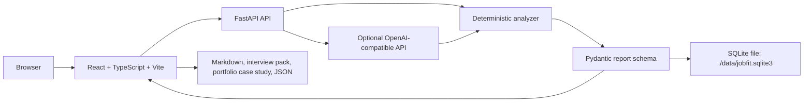
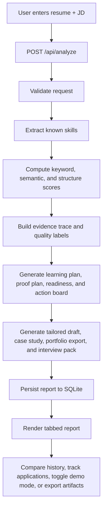
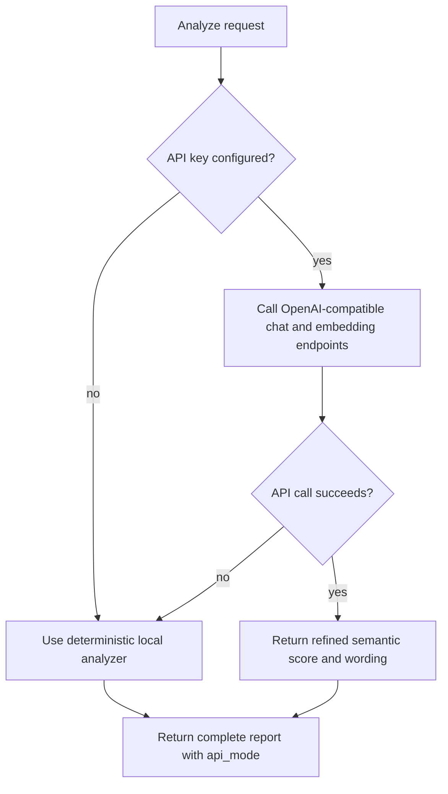
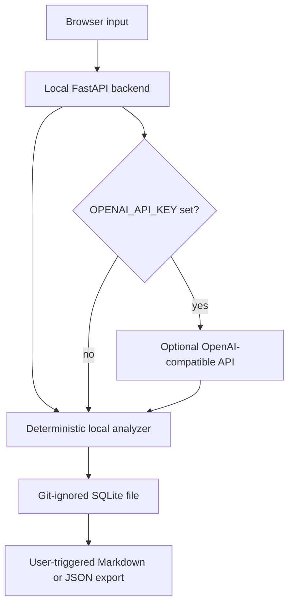

# JobFit RAG Architecture

JobFit RAG is a local-first, evidence-grounded resume/JD analyzer with optional AI refinement. It uses a RAG-style grounding pattern against resume and JD evidence; it is not a traditional vector-database RAG platform in v1.

## Design Principles

- Docker-first runtime
- Local-first data storage
- No local LLM
- No heavy infrastructure
- Clear portfolio value
- Simple code paths that can be explained in interviews

## Components



```text
frontend/
  React + TypeScript + Vite
  Single-page workflow
  Labeled forms and accessible tab state
  Resume version matrix
  Report history
  Report comparison
  Application tracker
  Interview pack export
  Proof plan view
  Portfolio readiness score
  Action board
  Portfolio case study export
  Portfolio demo mode
  JSON import/export
  Bilingual UI
  Markdown export

backend/
  FastAPI
  Pydantic models
  Deterministic analyzer
  Optional OpenAI-compatible API refinement
  PDF/TXT/MD parsing
  SQLite persistence
  Application tracking endpoints

data/
  Mounted SQLite file

scripts/
  Docker-first smoke verification
  Docker-free verify-local gate
  Demo data reset and seed workflow
  Redacted failure output for secret scans, HTTP bodies, and private assertion values
```

## Request Flow



## AI Extension Point

The app is deterministic by default so it can run without API keys. When `OPENAI_API_KEY` is set, API-based calls refine:

- resume bullet rewriting
- interview question generation
- embedding-based semantic matching
- API mode status

If the API fails or no key is present, the backend falls back to local scoring and template-based report generation.



## Infrastructure Decisions

The project keeps the runtime small on purpose:

| Decision | Reason |
| --- | --- |
| Docker Compose | Repeatable full local demo without host dependency drift. |
| Docker-free `verify-local` | Fast local gate for frontend build, accessibility source checks, and backend Python syntax when Docker is unavailable. |
| SQLite | Private career data stays in one local file that can be backed up or reset. |
| Deterministic fallback | The product works without API keys, network calls, or paid services. |
| Optional OpenAI-compatible API | Tokens can improve semantic scoring without becoming a hard dependency. |
| No vector database | Current scope compares one resume and one JD, so a vector service would add operational weight without enough value. |
| No PostgreSQL or Redis | Single-user local workflow does not need networked persistence, cache, or queues. |
| No local LLM | Weak laptops stay usable; the app avoids GPU and large model downloads. |

## Privacy Boundary



Default analysis stays local. Remote API calls are an optional enhancement, and missing keys or API failures still produce a complete report. Local data and `.env` are excluded from git by default. Frontend API failures use status-only messages, and verification scripts redact raw secret matches, HTTP response bodies, and private expected/actual assertion values in failure output.

## Hardware Fit

The app avoids PostgreSQL, Redis, Chroma, local LLMs, OCR, and workers. Runtime memory stays small enough for a weak 16GB RAM Windows laptop.

## v0.3 Data Additions

Each report now stores:

- `learning_plan`: seven lightweight actions tied to missing skills.
- `bullet_scores`: resume bullet rubric checks for action, technology, result, and metric.
- `evidence_trace`: skill-level resume evidence, JD evidence, gap reason, and recommendation.
- `tailored_resume`: truthful JD-specific summary, skills, and bullets.
- `case_study`: portfolio walkthrough for interviews.

Report comparison is computed in the browser from two persisted reports, so no new backend table or service is needed.

## v0.4 Import / Export

`GET /api/reports-export` returns a versioned JSON bundle with up to 200 valid reports.

`POST /api/reports-import` restores the same bundle by saving each report back into SQLite.

Duplicate report IDs are skipped instead of overwritten, and the import response exposes `imported` and `skipped` counts.

Older incompatible payloads are skipped during export so a local database from previous versions does not break the tool.

## v0.5 Evidence Quality And Tracker

Each evidence trace item now includes:

- `quality`: `direct`, `weak`, or `missing`
- `quality_score`: 0-100 confidence-style score for resume evidence strength

Direct evidence requires project, delivery, action, or metric context. Weak evidence is a keyword mention without enough proof. Missing evidence stays explicit and receives a zero quality score.

SQLite also stores a lightweight `applications` table for job-search workflow tracking:

- company
- role
- status
- next action
- optional linked report ID

This keeps the project useful for real job hunting without adding accounts, cloud sync, or background workers.

## v0.6 Interview Pack Export

Each report now stores `interview_pack`:

- positioning statement
- STAR answers generated from strongest evidence trace rows
- risk notes for missing or weak evidence
- close pitch for portfolio walkthroughs

The frontend can export a focused interview-pack Markdown file. It also includes linked application tracker rows for the current report, keeping interview prep connected to the target role without adding new services.

## v0.7 Proof Artifact Planner

Each report now stores `proof_plan` for weak or missing evidence:

- skill
- risk level: `weak` or `missing`
- proof artifact to produce
- small task
- acceptance check
- estimated days

The proof plan is generated from the evidence trace, so it stays explainable and does not add a new database or background worker. The frontend renders it as a report tab and includes it in the main Markdown export.

## v0.8 Portfolio Readiness Score

Each report now stores `portfolio_readiness`:

- score
- level: `draft`, `almost_ready`, or `ready`
- strengths
- blockers
- next best action

The score is deterministic and derived from existing report data: overall match score, evidence quality, strong resume bullets, proof-plan risk, case study completeness, and interview-pack completeness. It gives a solo job seeker one high-level answer: whether the current proof is ready to show, or what to fix first.

## v0.9 Action Board

Each report now stores `action_board`:

- title
- source: `proof_plan`, `bullet_score`, or `readiness`
- skill
- priority: `high`, `medium`, or `low`
- reason
- acceptance check
- estimated days

The board is deterministic and derived from existing report sections. Missing proof artifacts become high-priority items, weak evidence becomes medium-priority proof work, low-scoring bullets become rewrite tasks, and the top readiness blocker becomes a focused action. This keeps the app useful after the analysis step without adding accounts, queues, notifications, or a separate task database.

## v1.0 Portfolio Case Study Export

Each report now stores `portfolio_export`:

- headline
- problem
- solution
- architecture
- tradeoffs
- proof artifacts
- readiness summary
- next actions
- resume bullet

The export is generated from existing case study, readiness, proof plan, action board, and optimized bullet data. It is designed as a README-ready Markdown story, so the user can reuse the strongest project narrative in GitHub, a portfolio page, or interview prep without adding PDF generation, office document libraries, cloud sync, or another persistence table.

## v1.1 Local Smoke Script

`scripts/smoke.ps1` runs the project verification path from one command:

- backend image build
- frontend image build
- backend pytest
- frontend production build
- Docker Compose runtime
- backend health check
- frontend HTTP check
- analyze API smoke
- local secret pattern scan

The script stays Docker-first and does not require host Node or Python dependencies. It is intended for interview demos and local regression checks before sharing the portfolio.

## v1.2 Demo Data Reset

`scripts/reset-demo.ps1` resets local demo data for repeatable interviews:

- stops Docker Compose services unless `-NoDocker` is used
- optionally backs up `data/jobfit.sqlite3`
- removes the current SQLite file
- restarts services so the backend recreates schema
- seeds two stable reports through `/api/analyze`
- seeds one application tracker row through `/api/applications`
- verifies report and application counts

The script only targets the project `data/` directory and does not touch `.env` or source files. Seeding through the API keeps saved payloads aligned with the current report schema.

## v1.3 README Polish

The README now starts with portfolio-first sections:

- what the project proves
- why it exists
- quick demo commands
- portfolio proof artifacts
- verification commands
- hardware fit

The detailed feature list stays below the first-impression story so reviewers can understand value before scanning implementation detail.

## v1.4 Architecture Proof Pack

The README and architecture docs now include:

- top-level Mermaid architecture diagram
- request flow diagram
- API fallback diagram
- infrastructure decision table
- explicit reasons for avoiding vector databases, PostgreSQL, Redis, local LLMs, and worker queues

This keeps the project explainable in interviews while preserving the lightweight local runtime.

## v1.5 Privacy And Trust Pack

The project now documents its data and secret boundaries:

- default local deterministic report generation
- optional OpenAI-compatible API path
- git-ignored `.env` and `data/`
- SQLite report storage under `./data/jobfit.sqlite3`
- reset backup behavior
- report export privacy warning
- smoke secret scan as a sharing gate

This makes the local-first claim auditable instead of just promotional.

## v1.6 Screenshot Evidence Pack

The README now includes real screenshots generated from the local Docker Compose runtime:

- `docs/jobfit-rag-demo-input.png`
- `docs/jobfit-rag-demo-report.png`

The screenshots show the input workflow and analyzed report state so reviewers can see a real product surface before reading implementation details.

## v1.7 Release Checklist

`docs/release-checklist.md` now defines the project sharing gate:

- reset demo state
- run smoke verification
- check running services
- inspect shareable evidence
- avoid private local data
- follow interview demo order
- reuse strong resume bullets
- state known product boundaries

This turns the project into a handoff-ready portfolio artifact rather than only a runnable local app.

## v1.8 CI Lite

`.github/workflows/smoke.yml` now runs the Docker-first verification path on GitHub Actions:

- checkout repository
- print Docker versions
- run `scripts/reset-demo.ps1 -NoBackup`
- run `scripts/smoke.ps1`
- print `docker compose ps`
- stop services with `docker compose down`

The workflow does not require secrets. It uses the deterministic fallback path, so CI verifies the same local-first behavior that a reviewer can run on a laptop.

## v1.9 Chinese Interview Pack

`docs/interview-zh.md` now packages the project for Chinese interview delivery:

- 30-second introduction
- 2-minute talk track
- architecture explanation
- privacy explanation
- CI explanation
- resume bullets
- common follow-up questions
- honest product boundaries
- live demo order

This helps the project read as an employability artifact, not only a code repository.

## v2.0 Evaluation Fixtures

The project now includes a lightweight analyzer evaluation layer:

- `docs/evaluation-fixtures.json` stores fixed resume/JD cases and expected behavior.
- `scripts/evaluate-fixtures.ps1` calls the running `/api/analyze` endpoint.
- The script checks score ranges, matched skills, missing skills, API mode, readiness, action items, and required report sections.
- `scripts/smoke.ps1` runs the fixture check before the secret scan.

The fixtures avoid brittle wording assertions and focus on stable product behavior.

## v2.1 Markdown Quality Gate

`scripts/check-markdown-quality.ps1` now validates export completeness through the running API:

- calls `/api/analyze`
- verifies report data required by export surfaces
- builds report, interview pack, and portfolio case study Markdown structures
- checks required headings and core content
- runs from `scripts/smoke.ps1`

This treats Markdown exports as product deliverables, not just download buttons.

## v2.2 API Contract Pack

The backend contract is now documented and checked:

- `docs/api-contract.md` describes endpoints and key schemas.
- `docs/openapi.json` stores the generated OpenAPI snapshot.
- `scripts/check-api-contract.ps1` pulls `/openapi.json`, compares it with the snapshot, and verifies required routes, schemas, and fields. Use `-UpdateSnapshot` only when intentionally refreshing `docs/openapi.json`.
- `scripts/smoke.ps1` runs the contract check before the secret scan.

This makes the API surface auditable for reviewers and keeps frontend/export expectations tied to the backend schema.

## v2.3 Negative Path Pack

The project now verifies stable error behavior:

- backend tests cover missing analyze fields, unsupported resume uploads, missing reports, unsupported import versions, and missing applications
- `scripts/check-negative-paths.ps1` calls the running backend and checks validation, `400`, and `404` responses
- unsupported import versions are verified not to delete existing reports
- `scripts/smoke.ps1` runs the negative path gate before the secret scan

This keeps the local API trustworthy beyond the happy path without adding new services or dependencies.

## v2.4 Data Integrity Pack

Report backup/restore now has an explicit integrity gate:

- duplicate report IDs are skipped during import instead of overwriting local data
- `ReportsImportResult` reports both imported and skipped counts
- backend tests verify duplicate imports do not overwrite existing report payloads
- `scripts/check-data-integrity.ps1` verifies export, delete, restore, duplicate skip, and summary preservation through the running backend
- `scripts/smoke.ps1` runs the data integrity gate before negative path checks

This makes local JSON backup/restore repeatable and safer for real resume data.

## v2.5 Accessibility Pack

The frontend now includes a small accessibility baseline:

- resume and JD textareas have stable IDs and helper text via `aria-describedby`
- resume upload and tracker inputs have accessible labels
- language and demo toggles expose `aria-pressed`
- report tabs use `tablist`, `tab`, `aria-selected`, and `tabpanel`
- loading/error action area uses polite live regions
- JSON import is keyboard-friendly through a visible button and hidden file input
- CSS includes `:focus-visible` and `.visually-hidden`
- `scripts/check-accessibility.ps1` statically verifies these hooks and runs from smoke

This is not a full WCAG certification, but it makes the UI more keyboard- and screen-reader-friendly without adding dependencies.

## v2.6 Resume Version Matrix

The project now compares multiple resume versions against the same JD:

- `POST /api/resume-matrix` accepts one JD and two to four labeled resume versions
- the backend reuses the deterministic analyzer without saving matrix runs into report history
- response includes best version, score delta, gained skills, remaining gaps, readiness score, and recommendations
- the frontend adds a matrix panel for comparing the current resume with a tailored version
- `scripts/check-resume-matrix.ps1` verifies the live API and runs from smoke

This turns resume tailoring into an inspectable workflow instead of a one-shot score.
